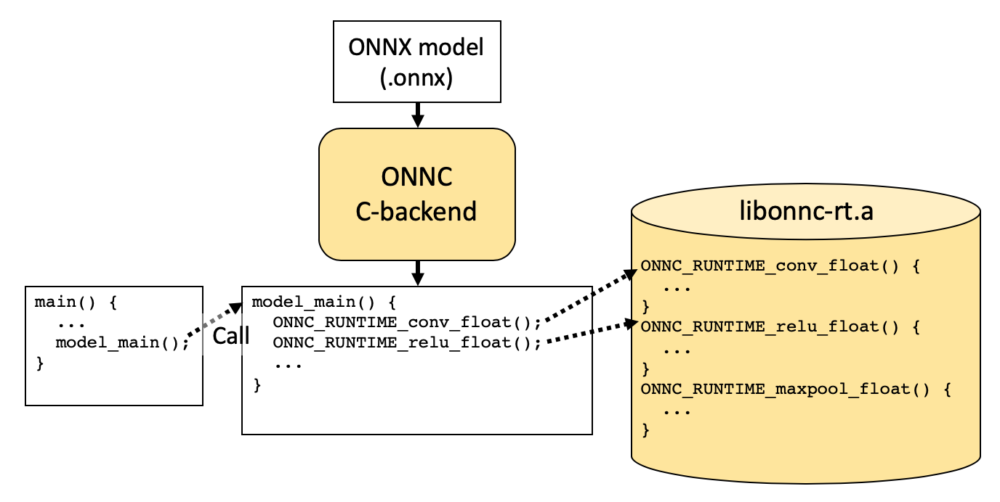
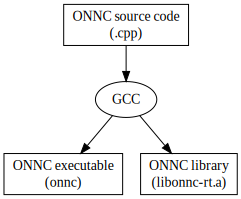
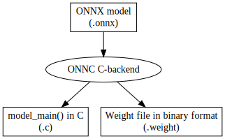
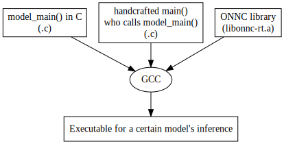
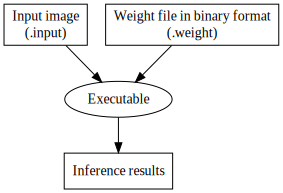

ONNC C-backend Tutorial
===

# Preface

Chances are that we want to perform model inference by running an executable natively on the machine instead of calling APIs through a training platform like TensorFlow or PyTorch. ONNC provides **C-backend** to help generate such an executable.

C-backend, as the name suggests, can generate a C file. The C file provides a function that can perform inference computation for a given model. This backend is similar to [ONNC ARM Cortex-M backend](https://github.com/ONNC/onnc-tutorial/blob/master/lab_2_Digit_Recognition_with_ARM_CortexM/lab_2.md) and both backends can generate C code. The difference is that the Cortex-M backend utilizes the CMSIS-NN library in the generated C function to perform the computation of many neural network operators. However, C-backend does not need to rely on any hardware-specific library (though it can rely on Intel MKLDNN library, if you want, to accelerate computations on Intel CPU.) ONNC provides a set of function implementation in **plain C code** for most neural network operators. No trick associated with hardware-specific instructions is used.

The architecture is shown as follows. The highlighted parts are ONNC framework, including a compiler (ONNC C-backend) and a library (libonnc-rt.a). The library provides function implementation of many neural network operators. The compiler can compile a given model in ONNX format and then generate a C file containing `model_main()` function which further calls the operator APIs defined in the library to perform a specific inference.

Finally, the user needs to implement the `main()` function which does some setting-up stuff according to the application's need, and most importantly, calls the `model_main()` function to perform the inference.



In this tutorial, we will show how to build ONNC C-backend and then use it to generate an executable for running inference for a specific model.

# Prerequisite

It is required to install Docker to run container images and Git to retrieve ONNC source code.

Please refer to the following links for more details:
- Docker (http://www.docker.com)
- Git (https://git-scm.com)

## Retrieve Source Code from Github
The latest ONNC source code is available on [ONNC GitHub](https://github.com/ONNC/onnc). Download it with the following command.

```shell=
// clone ONNC source code from ONNC GitHub
$ git clone https://github.com/ONNC/onnc.git

// There are two branches related to C-backend
// master   - C-backend + MKLDNN
// cbackend - only C-backend
$ cd onnc
// $ git checkout cbackend
```

## Retrieve ONNC Image from Docker Hub

The ONNC Docker image provides a ready-to-run working environment with all dependent libraries pre-installed.

Pull the image from the Docker Hub with the following command.
```shell=
// pull onnc-community container image from Docker Hub
$ docker pull onnc/onnc-community
```

Check whether the container image is pulled successfully.
```shell=
// check whether the container image is pulled successfully
$ docker images
```

You should see similar info as the following figure shows. Please make sure that `onnc/onnc-community` is list on your screen.
```
REPOSITORY            TAG                 IMAGE ID            CREATED             SIZE
onnc/onnc-community   latest              596bda662ba2        4 days ago          3.97GB
```

# Using ONNC C Backend

## Step 1: Run ONNC Docker
After pulling the container image, you can run the container image with the following command.

```shell=
// run the container image
$ docker run -it --cap-add=SYS_PTRACE --rm -v <absolute/path/to/onnc/on/your/machine>:/onnc/onnc onnc/onnc-community
```


- The `-it` option provides an interactive interface for the container.
- The `--cap-add=SYS_PTRACE` option is for debugging tools (e.g. gdb) to be fully functional. 
- The `--rm` option will automatically clean up the container when the container exits.
- The `-v` option mounts the directory to the Docker container. With this option, you can make any changes to the source code (<path/to/onnc>) outside the Docker container with your favorite editor and the change can be seen inside the Docker container and gets compiled.


If you have entered the container environment, you should see something like the following in your terminal.
```
onnc@399de80653d2:/onnc/onnc-umbrella/build-normal$
```

## Step 2: Build up ONNC

As we have mentioned, ONNC framework contains a compiler and a library. You will get those two parts after the building.



```shell=
// Build ONNC and ONNC runtime library.
$ smake -j8 install
+ ssync
+ rsync --verbose --checgksum --recursive --links --inplace --executability --chown=onnc:onnc --exclude=.git --delete /onnc//onnc/ /onnc//onnc-umbrella/src/
sending incremental file list
...
-- Up-to-date: /onnc/onnc-umbrella/install-normal/include/onnc/Analysis/NodeIRScheduler.h
-- Up-to-date: /onnc/onnc-umbrella/install-normal/include/onnc
-- Up-to-date: /onnc/onnc-umbrella/install-normal/include/onnc/Support
-- Up-to-date: /onnc/onnc-umbrella/install-normal/include/onnc/Support/DataTypes.h
-- Up-to-date: /onnc/onnc-umbrella/install-normal/include/onnc/Config
-- Up-to-date: /onnc/onnc-umbrella/install-normal/include/onnc/Config/Platforms.def
-- Up-to-date: /onnc/onnc-umbrella/install-normal/include/onnc/Config/Config.h
-- Up-to-date: /onnc/onnc-umbrella/install-normal/include/onnc/Config/Backends.def
-- Up-to-date: /onnc/onnc-umbrella/install-normal/include/onnc/Config/ONNX.h
```

- The `-j` option tells `make` to execute many recipes simultaneously.

Then copy the ONNC runtime library to where the machine defines to put linking libraries, usually defined by the `LD_PATH` environment variable.
```shell=
// Update ONNC runtime library to the system.
$ sudo cp /onnc/onnc-umbrella/build-normal/lib/Runtime/libonnc-rt.a /usr/local/lib
```

## Step 3: Use ONNC C-backend to compile an ONNX model.

Here we use the AlexNet model as an example and use ONNC C-backend to generate the corresponding `.c` file and `.weight` file for the model.



```shell=
$ onnc -mquadruple clang /models/bvlc_alexnet/model.onnx -o ./onnc-runtime-service.c
CLang is invoked
[Clang] created model weight file: ./onnc-runtime-service.weight

// Check if the compilation was really done successfully.
$ ls -1 onnc-runtime-service.*
onnc-runtime-service.c
onnc-runtime-service.weight
```

## Step 4: Use GCC to compile the generated C file

ONNC C-backend can generate a C file that contains a function `model_main()` that can perform model inference when called. To invoke this inference function, we still need a main file so that we can derive an executable. The main file needs to do the following things.
- Read input images.
- Read weights.
- Call `model_main()`
- Show the inference result.



We have provided a directory that contains all the needed main file, utilities, and makefile for you to have a quick trial. The directory is `/onnc/onnc/example/runtime/` within the ONNC Docker. You can have this template as a guide to further develop your own.

The structure of this directory is as follows.

```
/onnc/onnc/example/runtime/
├── CMakeLists.txt
├── bin
├── include
|   └── onnc-runtime.h: declares functions in the runtime library.
└── src
    ├── CMakeLists.txt
    ├── client-app.c: defines main().
    ├── client-lib.c: provides utilities like input parser.
    └── onnc-runtime-core.c: defines model_main().
```

Compile the project by the following commands.

```shell=
$ cd /onnc/onnc/example/runtime
$ mv /onnc/onnc-umbrella/build-normal/onnc-runtime-service.c src
$ mkdir build
$ mv /onnc/onnc-umbrella/build-normal/onnc-runtime-service.weight build
$ cd build
$ cmake .. && make
-- The C compiler identification is GNU 7.5.0
-- The CXX compiler identification is GNU 7.5.0
-- Check for working C compiler: /usr/bin/cc
-- Check for working C compiler: /usr/bin/cc -- works
-- Detecting C compiler ABI info
-- Detecting C compiler ABI info - done
...
Scanning dependencies of target inference
[ 20%] Building C object src/CMakeFiles/inference.dir/client-app.c.o
[ 40%] Building C object src/CMakeFiles/inference.dir/client-lib.c.o
[ 60%] Building C object src/CMakeFiles/inference.dir/onnc-runtime-service.c.o
[ 80%] Building C object src/CMakeFiles/inference.dir/onnc-runtime-core.c.o
[100%] Linking C executable inference
[100%] Built target inference
```

After `make`, you will get an executable `inference` under `/onnc/onnc/example/runtime/build/src`.

## Step 5: Generate input image

Generate the input image for Alexnet with `pb2t`. The original imput image is placed in `/models/bvlc_alexnet/test_data_set_*/`.

```shell=
// Generate input image for alexnet
$ ../bin/pb2t /models/bvlc_alexnet/test_data_set_0/input_0.pb ./bvlc_alexnet.input
```

## Step 6: Run AlexNet inference

Now you can utilize the `.input` file and `.weight` file generated in the above steps to run inference for model AlexNet. The result is a vector containing several predicted values and showed on the screen.



```shell=
// Run inference.
$ ./src/inference bvlc_alexnet.input onnc-runtime-service.weight
[0.000043, 0.000046, 0.000024, 0.000011, 0.000114, 
...
0.000148, 0.000964, 0.000134, 0.001431, 0.000448, ]
```